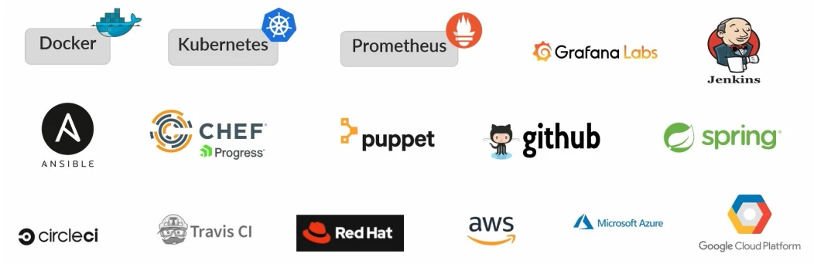
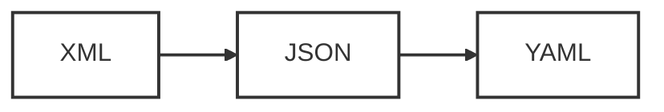

## Materi: Pengetahuan & Konsep

### 1. Pengantar

Selamat datang di materi "YAML & JSON: The Next Level". Fokus utama kita di sini adalah memahami YAML, sebuah format yang menjadi standar industri untuk **Configuration Management** di dunia DevOps.

Sementara JSON lebih dominan di pengembangan web, YAML adalah raja di sisi infrastruktur dan konfigurasi.

### 2. Apa itu YAML?

YAML (dibaca: _yamel_) didefinisikan sebagai _lightweight, human-readable Data Serialization language_.

- **Kepanjangan**: Awalnya dikenal sebagai "Yet Another Markup Language", namun kini secara resmi disebut **"YAML Ain't Markup Language"**. Perubahan nama ini menegaskan bahwa YAML berfokus pada data, bukan dokumen markup.
- **Ekstensi File**: File YAML disimpan dengan ekstensi `.yaml` atau `.yml`.
- **Filosofi Desain**: Didesain agar mudah dibaca oleh manusia (_human-readable_) namun tetap memiliki fitur canggih untuk merepresentasikan data yang kompleks.
- **Karakteristik Utama**:
  - **Minimalis**: Menggunakan sintaks yang sangat minim karakter struktural (seperti kurung kurawal atau tag penutup) dibandingkan XML atau JSON.
  - **Interoperable**: Terbuka dan dapat digunakan lintas bahasa pemrograman.
  - **Built on Existing Concepts**: Dibangun di atas konsep bahasa pemrograman yang sudah ada, sehingga mudah dipelajari oleh developer.

### 3. Mengapa Menggunakan YAML?

Di tengah banyaknya format data yang tersedia, YAML menjadi pilihan utama karena beberapa alasan strategis:

- **Cross Platform & Portable**: Dapat digunakan di berbagai sistem operasi dan lingkungan.
- **Easily Readable**: Struktur indentasi membuatnya sangat mudah dipahami secara visual, bahkan oleh non-programmer.
- **Easy to Implement**: Mudah diintegrasikan ke dalam sistem yang sudah ada.



Penggunaan YAML sangat masif di ekosistem modern cloud-native. Beberapa _industry-leading tools_ yang menggunakan YAML secara ekstensif meliputi:

- **Container & Orchestration**: Docker, Kubernetes.
- **CI/CD**: Jenkins, CircleCI, Travis CI, GitHub Actions.
- **Infrastructure as Code & Config**: Ansible, Chef, Puppet, Terraform.
- **Cloud Providers**: AWS, Google Cloud Platform (GCP), Microsoft Azure.
- **Monitoring**: Prometheus, Grafana.

### 4. Evolusi & Perbandingan: XML vs JSON vs YAML

Untuk memahami posisi YAML, kita perlu melihat evolusinya dari format pendahulu.



Berikut adalah perbandingan teknis representasi data "Employee Record" (Rekaman Karyawan) dalam tiga format berbeda. Perhatikan bagaimana sintaks menjadi semakin bersih dan fokus pada data.

#### A. XML (eXtensible Markup Language)

Format lawas yang sangat _verbose_ (bertele-tele). Menggunakan tag pembuka dan penutup yang memakan banyak ruang.

```xml
<?xml version="1.0" encoding="UTF-8"?>
<EmpRecord>
   <Employee id="emp01">
      <name>Alex</name>
      <job>Developer</job>
      <skills>python, C/C++, Pascal</skills>
   </Employee>
   <Employee id="emp02">
      <name>Bob</name>
      <job>Tester</job>
      <skills>Lisp, Fortran, REST APIs</skills>
   </Employee>
</EmpRecord>
```

#### B. JSON (JavaScript Object Notation)

Lebih ringkas dari XML, standar _de facto_ untuk API web. Namun, masih menggunakan banyak karakter struktural seperti kurung kurawal `{}`, kurung siku `[]`, dan tanda kutip ganda `""` yang ketat.

```json
{
  "EmpRecord": {
    "Employee": [
      {
        "-id": "emp01",
        "name": "Alex",
        "job": "Developer",
        "skills": "python, C/C++, Pascal"
      },
      {
        "-id": "emp02",
        "name": "Bob",
        "job": "Tester",
        "skills": "Lisp, Fortran, REST APIs"
      }
    ]
  }
}
```

#### C. YAML (YAML Ain't Markup Language)

Bentuk paling modern dan bersih. Struktur data ditentukan oleh **indentasi (spasi)** dan baris baru, bukan kurung kurawal. Ini menghilangkan "noise" visual dan membiarkan kita fokus pada datanya saja.

```yaml
---
EmpRecord:
  Employee:
    - '-id': emp01
      name: Alex
      job: Developer
      skills: python, C/C++, Pascal
    - '-id': emp02
      name: Bob
      job: Tester
      skills: Lisp, Fortran, REST APIs
```

---

## Praktik

### Studi Kasus: Transformasi Data

Di bagian ini, kita akan mempraktikkan cara membaca struktur YAML dengan membandingkannya langsung dengan JSON.

**Langkah 1: Analisis Struktur**
Perhatikan potongan kode YAML di atas pada bagian `Employee`.

- Tanda `-` (strip) di awal baris menandakan sebuah item dalam **List** (Daftar) atau Array. Ini setara dengan `[...]` di JSON.
- Pasangan `key: value` (contoh: `name: Alex`) adalah data objek standar.
- Indentasi (spasi di sebelah kiri) sangat krusial. Kesalahan satu spasi saja dapat membuat file YAML tidak valid.

**Langkah 2: Persiapan Environment**
Untuk sesi praktik selanjutnya, pastikan Anda memiliki text editor yang mendukung syntax highlighting YAML (seperti VS Code) untuk memudahkan pembelajaran.
