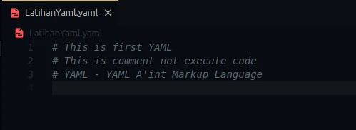

Kali ini membahas fondasi paling dasar dari YAML, yaitu pasangan Kunci-Nilai (_Key-Value Pairs_), serta cara menulis dan memvalidasi file YAML dengan benar.

---

## Materi: Pengetahuan & Konsep

### 1. Konsep Key-Value Pairs

Struktur paling mendasar dalam YAML adalah **Key-Value Pair** (Pasangan Kunci-Nilai). Konsep ini mirip dengan _Dictionary_ di Python, _Map_ di Java, atau _Object_ di Javascript. Setiap data direpresentasikan sebagai pemetaan antara sebuah nama (`Key`) dan nilainya (`Value`).

**Aturan Penulisan Key-Value:**

- **Pemisah**: Gunakan tanda titik dua `:` diikuti oleh **spasi** untuk memisahkan Key dan Value. (Contoh: `Key: Value`).
- **Spasi**: Anda **bisa** menggunakan spasi di dalam nama Key (Contoh: `Nama Lengkap: Budi`).
- **Quotes**: Anda bisa menggunakan tanda kutip tunggal `'...'` atau ganda `"..."` pada nama Key, tetapi ini opsional kecuali Key mengandung karakter khusus.
- **Unik**: Key **tidak boleh duplikat** dalam satu level indentasi (ruang lingkup) yang sama.

### 2. Sensitivitas & Indentasi

YAML sangat ketat mengenai format penulisan:

- **Case Sensitive**: Huruf besar dan kecil dianggap berbeda.
  - Contoh: `name=levelup360` **TIDAK SAMA DENGAN** `Name=levelup360`.
- **Indentasi**: YAML menggunakan spasi (whitespace) untuk menentukan struktur hierarki, mirip dengan Python.
  - **PENTING**: Jangan pernah gunakan _Tab_ untuk indentasi, selalu gunakan _Space_.

### 3. Komentar (Comments)

Dalam pemrograman, komentar penting untuk dokumentasi. Di YAML:

- Komentar diawali dengan tanda pagar `#`.
- Semua teks setelah `#` hingga akhir baris akan diabaikan oleh parser.
- Bisa diletakkan di baris baru atau di akhir baris kode.



### 4. Tools & Validasi

Untuk memastikan file YAML yang kita tulis valid (bebas error sintaks), kita memerlukan alat bantu.

- **Online Tools**:
  - **YAML Viewer/Validator**: [yaml viewer](https://jsonformatter.org/yaml-viewer) (Untuk melihat struktur dan memvalidasi).
  - **YAML to JSON Converter**: [yaml to json](https://jsonformatter.org/yaml-to-json) (Berguna untuk debugging).
- **Programming Libraries**: Hampir semua bahasa modern (Python, Go, Java, dll) memiliki library resmi untuk memproses YAML, yang bisa dicek di `yaml.org`.

---

## Praktik: Menulis & Memvalidasi YAML

Di sesi praktik ini, kita akan membuat file YAML sederhana yang menerapkan aturan _Key-Value_, _Comments_, dan _Case Sensitivity_.

### Langkah 1: Membuat File

Buatlah file baru bernama `latihan_satu.yaml` di text editor Anda (VS Code disarankan).

### Langkah 2: Menulis Kode

Salin kode berikut. Perhatikan penggunaan spasi setelah tanda titik dua `:`.

```yaml
# --- Latihan Sesi 2 ---
# Ini adalah contoh komentar satu baris

Data Peserta:
  # Key dengan spasi diperbolehkan
  Nama Lengkap: 'John Doe'

  # Key bersifat case-sensitive
  role: Developer # 'role' huruf kecil
  Role: Admin # 'Role' huruf besar (dianggap data berbeda)

  # Tipe data otomatis terdeteksi
  umur: 28
  aktif: true
```

### Langkah 3: Validasi Online

Mari kita buktikan apakah kode di atas valid.

1.  Buka browser dan kunjungi [YAML Validator](https://jsonformatter.org/yaml-viewer).
2.  Salin (Copy) kode dari `latihan_satu.yaml`.
3.  Tempel (Paste) ke kolom input di website tersebut.
4.  **Hasil**: Jika valid, tidak akan muncul pesan error, dan Anda mungkin melihat struktur data yang rapi di panel sebelah kanan. Coba hapus spasi setelah titik dua pada `umur: 28` (menjadi **`umur:28`**), maka validator akan menampilkan error. Ini membuktikan pentingnya spasi di YAML.
