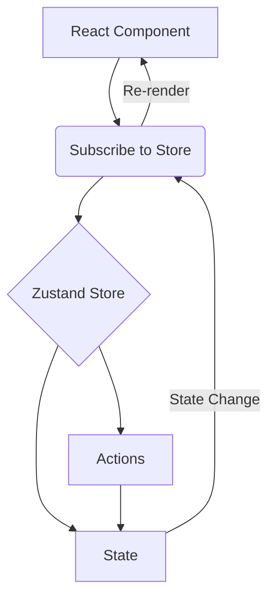

Di sesi ini, target kita adalah memahami bagaimana Zustand bekerja "di belakang layar" dan membuat store pertama yang _performant_.

## Bagian 1: Materi & Konsep

### 1. Filosofi "Small, Fast, and Scalable"

Zustand menggunakan model **Pub/Sub (Publish/Subscribe)** yang disederhanakan.

- **Store**: Wadah tunggal tempat data (state) dan logika (actions) hidup berdampingan.
- **Hooks**: Berbeda dengan Redux yang butuh `connect` atau `Provider`, Zustand _adalah_ hook itu sendiri. Saat Anda membuat store, Anda sebenarnya sedang membuat _custom hook_.

### 2. Anatomi `create` dan `set`

Fungsi utama Zustand adalah `create`. Fungsi ini menerima callback yang mengembalikan objek state awal.



#### Deep Dive: Fungsi `set`

Ini adalah bagian yang sering membingungkan pemula.

- **Merging Otomatis**: `set` di Zustand melakukan _shallow merge_ secara default (hanya menggabungkan level teratas objek). Anda tidak perlu menulis `...state` (spread operator) untuk bagian state yang tidak berubah, _kecuali_ Anda memodifikasi nested object (objek di dalam objek).
- **Immutable**: Meskipun sintaksnya terlihat langsung mengubah data, Zustand mengharuskan kita mengembalikan objek baru, bukan memutasi objek lama.

### 3. Konsep Selector (Kunci Performa)

Ini adalah perbedaan level Junior vs Senior saat pakai Zustand.

- **Cara Naif (Boros)**: Mengambil seluruh state. Komponen akan render ulang setiap kali _ada_ data di store berubah, meskipun data yang kita pakai tidak berubah.
- **Cara Pro (Selector)**: Hanya mengambil potongan kecil data yang dibutuhkan (Atomic selection). Komponen hanya render ulang jika potongan kecil itu berubah.

---

## Bagian 2: Praktik (Coding Step-by-Step)

Mari kita buat **Dashboard Kontrol Sederhana**. Kita akan memiliki state angka (Counter) dan state status user (Boolean), untuk membuktikan bagaimana selektor bekerja.

### Langkah 1: Setup & Instalasi

Pastikan Anda sudah dalam environment React (Vite/Next.js/CRA).

```bash
npm install zustand
```

Jika menggunakan Typescript (Sangat disarankan untuk project serius):

```bash
npm install zustand @types/node
```

Kemuian install tailwind css. Jika anda menggunakan vite, cara installnya mudah lihat :

https://tailwindcss.com/docs/installation/using-vite

**tips:** tekan <kbd>ctrl</kbd> terlebih dahulu baru klik link di atas agar masuk ke tab baru

### Langkah 2: Membuat Store

Kita akan membuat file terpisah. Pisahkan logic dari UI.

```javascript title="useAppStore.js" wrap
import { create } from 'zustand';

// 1. Kita mendefinisikan store
const useAppStore = create((set) => ({
  // --- STATE (Data) ---
  count: 0,
  isActive: false,
  user: { name: 'Anonim', role: 'guest' },

  // --- ACTIONS (Logic) ---

  // Action 1: Update sederhana
  increaseCount: () => set((state) => ({ count: state.count + 1 })),

  // Action 2: Reset state (Hard replace value)
  resetCount: () => set({ count: 0 }),

  // Action 3: Toggle boolean (Mengakses state sebelumnya)
  toggleStatus: () => set((state) => ({ isActive: !state.isActive })),

  // Action 4: Update nested object (Hati-hati di sini!)
  // Perlu spread operator manual untuk nested object agar data lain tidak hilang
  updateUserName: (newName) =>
    set((state) => ({
      user: { ...state.user, name: newName },
    })),
}));

export default useAppStore;
```

### Langkah 3: Implementasi di Komponen (UI)

Kita akan memecah UI menjadi dua komponen terpisah untuk mendemonstrasikan **efisiensi rendering**.

**Komponen A: Hanya Peduli pada Count**

```javascript title="CounterDisplay.jsx" wrap
import useAppStore from './useAppStore';

const CounterDisplay = () => {
  // BAD PRACTICE (Jangan lakukan ini):
  // const { count, increaseCount } = useAppStore();
  // Kenapa? Jika 'isActive' berubah, komponen ini IKUT render ulang padahal tidak butuh 'isActive'.

  // GOOD PRACTICE (Atomic Selector):
  const count = useAppStore((state) => state.count);
  const increaseCount = useAppStore((state) => state.increaseCount);

  console.log('Render: CounterDisplay'); // Cek console untuk bukti

  return (
    <div className="border p-4 rounded shadow-md bg-white">
      <h2 className="text-xl font-bold">Counter Module</h2>
      <p className="text-4xl my-4">{count}</p>
      <button
        onClick={increaseCount}
        className="bg-blue-600 text-white px-4 py-2 rounded hover:bg-blue-700"
      >
        Tambah Angka
      </button>
    </div>
  );
};

export default CounterDisplay;
```

**Komponen B: Hanya Peduli pada Status**

```javascript title="StatusControl.jsx" wrap
import useAppStore from './useAppStore';

const StatusControl = () => {
  // Mengambil state isActive dan action toggle
  const isActive = useAppStore((state) => state.isActive);
  const toggleStatus = useAppStore((state) => state.toggleStatus);

  console.log('Render: StatusControl'); // Cek console

  return (
    <div className="border p-4 rounded shadow-md bg-white mt-4">
      <h2 className="text-xl font-bold">Status Module</h2>
      <div className="flex items-center gap-4 my-4">
        <div className={`w-4 h-4 rounded-full ${isActive ? 'bg-green-500' : 'bg-red-500'}`}></div>
        <span>Sistem: {isActive ? 'ONLINE' : 'OFFLINE'}</span>
      </div>
      <button
        onClick={toggleStatus}
        className="bg-gray-800 text-white px-4 py-2 rounded hover:bg-gray-900"
      >
        Ubah Status
      </button>
    </div>
  );
};

export default StatusControl;
```

### Langkah 4: Menyatukan di App

```javascript title="App.js" wrap
import CounterDisplay from './CounterDisplay';
import StatusControl from './StatusControl';

export default function App() {
  return (
    <div className="min-h-screen bg-gray-100 p-8 flex flex-col gap-6 max-w-xl mx-auto">
      <h1 className="text-3xl font-extrabold text-gray-800 mb-4">Zustand Dashboard</h1>

      {/* Dua komponen ini independen secara render */}
      <CounterDisplay />
      <StatusControl />

      <div className="text-sm text-gray-500 mt-8">
        <p>
          Tips: Buka Console browser (F12). Klik tombol di Counter, perhatikan bahwa StatusControl
          TIDAK melakukan log 'Render'. Ini bukti optimasi selector.
        </p>
      </div>
    </div>
  );
}
```

---

### Ringkasan Poin Kunci Sesi 1:

1.  **Buat Store**: Gunakan `create` dan definisikan state + actions di dalamnya.
2.  **Gunakan `set`**: Selalu gunakan `set` untuk update state. Gunakan format callback `set((state) => ...)` jika update bergantung pada data sebelumnya.
3.  **Selektif**: Jangan malas. Ambil state satu per satu menggunakan selector `state => state.value` untuk performa maksimal.
4.  **Pemisahan**: Store bertindak sebagai "Backend mini" di frontend. UI hanya bertugas menampilkan data dan memicu action.

Jika Anda sudah berhasil menjalankan kode di atas dan melihat log console sesuai prediksi (komponen render terpisah), Anda telah lulus Sesi 1.
